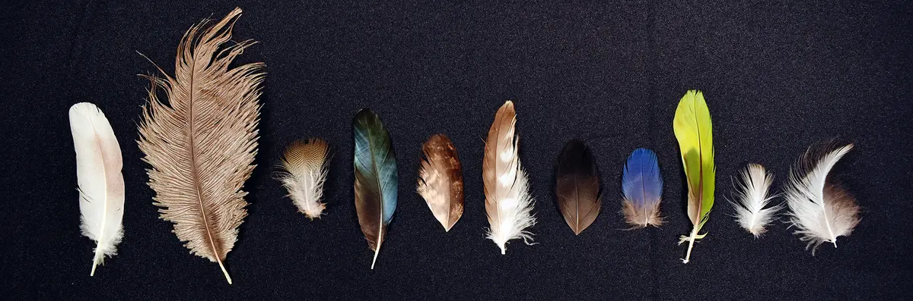
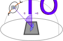

</img>

# CU-VarIS Feather Dataset

We measure light reflectance of feathers in a range of precisely controlled light and viewing directions.

Our motivation is to supply a collection of appearance data for opening new lines of inter-disciplinary research.

This effort is powered by Clemson University's [Bob Campbell Geology Museum](Bob Campbell Geology Museum) and the [School of Computing's Visual Computing Division](https://computing.clemson.edu/vcl/).

[Clemson World magazine article related to the VarIS capture system](https://clemson.world/keeping-it-real/)

[Eurographics STAG: VarIS: Variable Illumination Sphere for Facial Capture, Model Scanning, and Spatially Varying Appearance Acquisition.](https://diglib.eg.org/items/e7785cfc-6ab5-48fa-8eb4-408b744fc437)

Please contact Eric Patterson, Daljit Singh Dhillon, or N. Adam Smith at Clemson University for further details.

## Measurement Setup

The dataset contains photos of feather specimens taken under precisely controlled lighting and viewing directions.

<figure></img><figcaption>OLAT (One-Light-At-A-Time) Capture</figcaption></figure>

The **OLAT** (One Light At a Time) Capture 
measures feather reflectance as a function of light and viewing directions.

We acquire sets of OLAT images for 7 different viewing angles with just around 200 lights visible in each pose for a total of 1136 reflectance frames per feather sample.

For each viewing direction we additionally capture 4 images with the sample illuminated by all LEDs and patterns of gradient illumination along `X-`, `Y-`, and `Z-` global axes which serve to estimate the surface normal map.

<figure></img><figcaption>Retroreflection Capture</figcaption></figure>

We also measure the **retroreflection** of the feather samples in the setup where the lighting and viewing directions are aligned.
The retroreflection image sequence provides a preview of material reflectance critical for estimating the material's Normal Distribution Function.

We capture 128 retroreflection frames with angles spaced between 0 and 90 degrees. 

