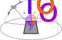

</img>

# CU-VarIS Feather Dataset

We measure light reflectance of feathers in a range of precisely controlled light and viewing directions.

Our motivation is to supply a collection of appearance data for opening new lines of inter-disciplinary research.

This effort is powered by Clemson University's [Bob Campbell Geology Museum](Bob Campbell Geology Museum) and the [School of Computing's Visual Computing Division](https://computing.clemson.edu/vcl/).

[Clemson World magazine article related to the VarIS capture system](https://clemson.world/keeping-it-real/)

Please contact Eric Patterson, Daljit Singh Dhillon, or N. Adam Smith at Clemson University for further details.

## Papers


**A Dataset and Analysis of Reflectance and Structural Imaging of Feathers**  
CV4Animals workshop at CVPR 2025  
<https://drive.google.com/file/d/11EpmqstGRZ2UM8aFfD944qN5Ndwu8fJN/view>


**Capturing the Complexity of Spatially Varying Surfaces with Adaptive Parameterization and Distribution Metrics**  
22nd ACM SIGGRAPH European Conference on Visual Media Production (**CVMP 2025**)  
<https://dl.acm.org/doi/10.1145/3756863.3769711>


**VarIS: Variable Illumination Sphere for Facial Capture, Model Scanning, and Spatially Varying Appearance Acquisition**  
Eurographics STAG 2023  
<https://diglib.eg.org/items/e7785cfc-6ab5-48fa-8eb4-408b744fc437>


## Measurement Setup

The dataset contains photos of feather specimens taken under precisely controlled lighting and viewing directions.

<figure></img><figcaption>OLAT (One-Light-At-A-Time) Capture</figcaption></figure>

The **OLAT** (One Light At a Time) Capture 
measures feather reflectance as a function of light and viewing directions.

We acquire sets of OLAT images for 7 different viewing angles with just around 200 lights visible in each pose for a total of 1136 reflectance frames per feather sample.

For each viewing direction we additionally capture 4 images with the sample illuminated by all LEDs and patterns of gradient illumination along `X-`, `Y-`, and `Z-` global axes which serve to estimate the surface normal map.


<figure></img><figcaption>Retroreflection Capture</figcaption></figure>

We also measure the **retroreflection** of the feather samples in the setup where the lighting and viewing directions are aligned.
The retroreflection image sequence provides a preview of material reflectance critical for estimating the material's Normal Distribution Function.

We capture 128 retroreflection frames with angles spaced between 0 and 90 degrees. 


## Using the dataset

### Cache location

The dataset files are automatically downloaded when needed to a local cache.
This is by default `{this repo}/dataset` but can be overwritten with env variable `CU_VARIS_FEATHER_DIR` or by setting `feather_dir` in `{this repo}/cu_varis_settings.json`.

### Load the captures

```py
from varis_feather import load_standard_capture
from varis_feather.Paths import DIR_DATASET, DIR_PROJECT
from varis_feather.Utilities.ImageIO import writeImage

retro, olat = load_standard_capture("FeatherRedCrownedAmazon")

# Get an example frame
frame = olat.frames[10]
img = olat.read_measurement_image(frame)
writeImage(img, "frame.exr")

# Plot by theta-phi
fig = olat.plot_crops_in_theta_phi("barb128", pose=(4, 0))
fig.savefig(f"{olat.name}_theta_phi.png")
```

### Notebook example

Please see the notebook example at [example.ipynb](example.ipynb).